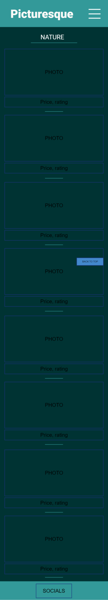
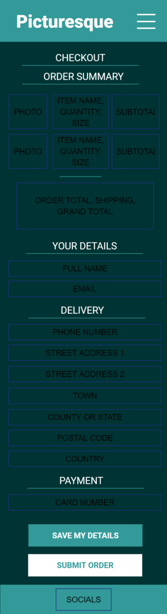
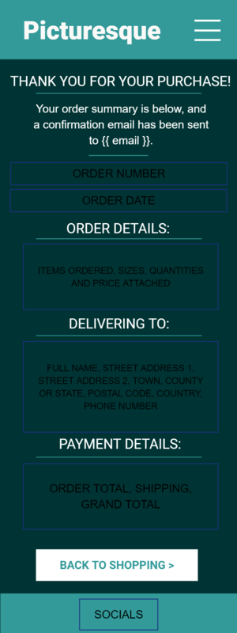
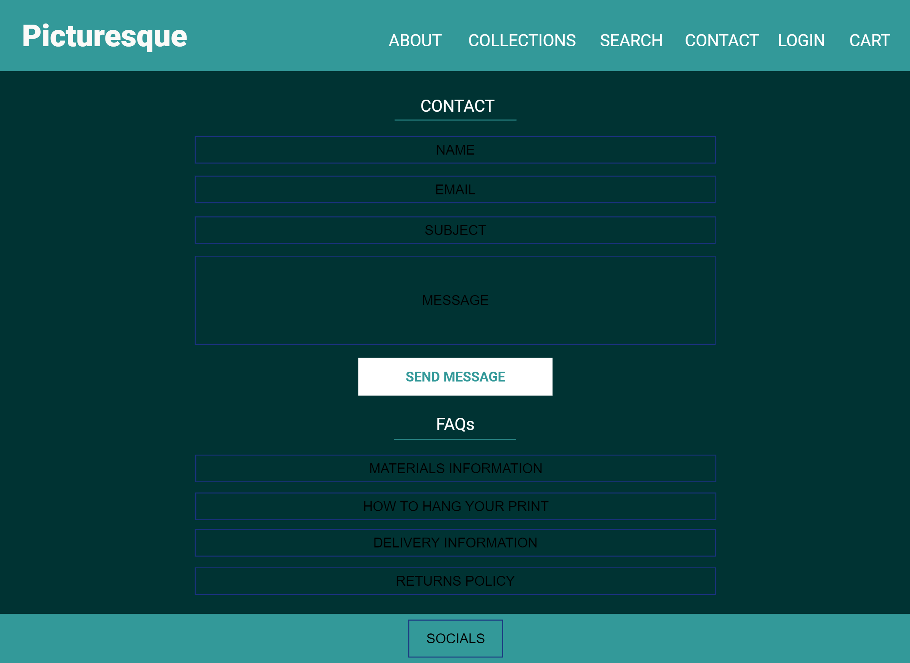

# Picturesque
## Full Stack Frameworks with Django Milestone Project - Code Institute
### Table of Contents:
1. [Project Purpose](#project-purpose)
2. [User Experience](#user-experience)
    - [Strategy](#strategy)
    - [Scope](#scope)
    - [Structure](#structure)
    - [Skeleton](#skeleton)
    - [Surface](#surface)
3. [Features](#features)
    - [Existing Features](#existing-features)
    - [Features Left to Implement](#features-left-to-implement)
4. [Technologies Used](#technologies-used)
5. [Testing](#testing)
    - [Full Testing](#full-testing)
    - [Validators](#validators)
    - [Screen Sizes](#screen-sizes)
    - [Browser Details](#browser-details)
    - [Bugs Found](#bugs-found)
6. [Deployment](#deployment)
    - [Deploying via Heroku](#deploying-via-heroku)
    - [Deploying locally](#deploying-locally)
7. [Credits](#credits)
    - [Content](#content)
    - [Media](#media)
    - [Acknowledgements](#acknowledgements)

## Project purpose
Picturesque is an e-commerce website built to sell prints of photographs displayed on the site.
The prints can be chosen to be in an array of sizes with prices which reflect the change of size.
The photographs showcased are from my personal holiday collection.

There is a landing page which tells the user more about the inspiration and photography side of the website.
There is a gallery of different collections as the photographs are subdivided into categories.
The user is able to look at a specific photograph in more details before choosing which size to purchase.
There is a user profile page where the user is able to view their order history and can update their saved details.
Finally, there is a contact page where there are FAQs about the products and a contact form for the users to contact the site owner directly.

## User Experience
### Strategy
The site user stories are listed below.
- Navigation and Viewing:
    - As a shopper, I want to be able to view a list of products, so that I can select products to purchase
    - As a shopper, I want to be able to view a particular category of the product, so that I can quickly filter through products I am interested in
    - As a shopper, I want to be able to view an individual products details, so that I can see the price, description, category, image and available sizes
    - As a shopper, I want to be able to easily view the total of my purchases at any time, so that I can avoid spending more money than desired

- Filtering and Searching:
    - As a shopper, I want to be able to sort the list of available products, so I can easily see the categorised products
    - As a shopper, I want to be able to sort a specific category of products, so that I can find my favourite product in a specific category and sort the category by name
    - As a shopper, I want to be able to sort multiple categories of products simultaneously, so that I can find the most appropriate product across broad categories
    - As a shopper, I want to be able to search for a product by name or description, so that I can find a specific product that I would like to purchase
    - As a shopper, I want to be able to easily see what I have searched for and the number of results, so that I can decide quickly if the product I want is available

- Purchasing and Checkout:
    - As a shopper, I want to be able to easily select the size and quantity of the product when purchasing it, so that I can ensure that I do not accidentally select the wrong product, quantity or size
    - As a shopper, I want to be able to view items in my shopping bag to be purchased, so that I can identify the total cost of my purchase and all the items I will receive
    - As a shopper, I want to be able to adjust the quantity of individual items in the cart, so that I can easily make changes to my purchase before I checkout
    - As a shopper, I want to be able to easily enter payment information, so that I can checkout quickly and easily
    - As a shopper, I want to be able to feel that my personal and payment information is secure, so that I can confidently provide the needed information to make a purchase
    - As a shopper, I want to be able to view an order confirmation after payment, so that I can verify that my items have been purchased correctly without any mistakes
    - As a shopper, I want to be able to receive an email confirmation of my purchase, so that I can keep the information of my purchase for personal records

- Registration and User Accounts:
    - As a site user, I want to be able to easily register for an account, so that I can have my own personal account and view my profile
    - As a site user, I want to have a personalised user profile, so that I can view my order history, order confirmations and to save my payment and shipping information
    - As a site user, I want to be able to easily log in or out of my account, so that I can access my personal account information
    - As a site user, I want to be able to recover any forgotten passwords in case I forget it, so that I can recover the access to my account
    - As a site user, I want to receive an email confirmation after registering my account, so that I can verify that my account registration was successful to the site

- Store Management and Administration:
    - As a store owner, I want to be able to add a product to the website, so that I can update new items to the store
    - As a store owner, I want to be able to edit or update an existing product on the website, so that I can change product prices, descriptions, sizes and/or images on the site
    - As a store owner, I want to be able to delete an existing product from the website, so that I can remove items that are no longer for sale

### Scope
Key features to include are:
- A navigation panel which is collapsible for smaller screen sizes
- A search function, so the user can search for a particular item or category
- A product detail page showing more information about the specific product
- The edit / delete options to be hidden on products page unless a store admin so that no accidental removals or edits occur
- A user profile page with order history and details, and saved personal information
- A self-updating bag total and bag details page
- A contact form and FAQs for any user enquiries
- Links to social media accounts of the product owner

### Structure
The page will have a standard header and footer in the site colour theme. The header navigation is collapsible for smaller screen sizes.

The main pages are:
- Home page with link to the main collections page and an about section to describe the website and inspiration behind the photographs
- The main collections page where the user can choose from the different categories of products
- The main products page which shows the products with prices, images, categories. This page can show search results and filtering based on categories
- The bag page shows the contents of a users bag with the ability to proceed to checkout or to modify the bag items
- The checkout page is where the user can input their data in order to complete the purchase
- The login / logout pages are utilising the Allauth templates and allow the user to log in or out or recover their password easily
- The order confirmation page allows the user to go back shopping after looking over a review of their latest purchase
- The user profile page shows the personal information saved and order history of the user which can be viewed at any point

The schema is as follows:
| Collection | Fields        |
|------------|---------------|
| Products   | id            |
|            | name          |
|            | description   |
|            | sku           |
|            | category      |
|            | image         |
| Category   |  id           |
|            | name          |
|            | friendly_name |

### Skeleton
The mockups for the website were created using GNU Pencil software. The full versions can be found [here](media/mockups/wireframe.pdf)

For ease of viewing, below are the main mockups:

#### Mobile Screens
- Mobile Home:

- Mobile Collections:

- Mobile Products:

- Mobile Product Details:

- Mobile Contact:

- Mobile Bag:

- Mobile Checkout:

- Mobile Checkout Success:

- Mobile Login or Sign Up:

- Mobile Profile:

#### Larger Screens
- Home:

- Collections:

- Products:

- Product Details:

- Contact:

- Bag:

- Checkout:

- Checkout Success:

- Login or Sign Up:

- Profile:

### Surface
The dark turquoise, light turquoise and white colour scheme was designed to feel chic yet intuitive and user-friendly.
The information should be easily picked out from the background colour, and the darker background makes the pages easier for the photographs to stand out.
The colour scheme is fairly muted which would appeal hopefully to users of all ages without any abrupt or harsh colours.

## Features
- This website is built using Django with added Bootstrap frameworks, CSS, JavaScript where applicable.
- The functionality of bootstrap classes and the flexible framework it provides allowed for an easily structured webpage.
- JavaScript and JQuery additions to selected buttons allowed for posting form updates to the backend Python scripts and other page updates.
- Using the Bootstrap navbar allowed for a seamless collapsible navbar, along with the smooth functionality of the Boostrap accordion menu for the FAQs.
- A PostgreSQL database is used to host the database and the whole project is deployed through an Heroku app.

### Existing Features
- On the products page, there is a "Back To Top" button which allows the users to easily go back to the top of the page
- The navbar is sticky, so the user can always see the amount in the cart and the navigation menu
- Autofill forms for the personal details (if they exist) in the profile and checkout pages
- Forms which allow users to input information into the database such as profile information, payment information and product information for admin users
- Font Awesome icons for the socials menu on the footer

### Features Left to Implement
- Price selection dropdown menu for the inputting of new products into the database
- Review functionality for the products from users after purchasing

## Technologies Used
- [HTML5](https://en.wikipedia.org/wiki/HTML5) 
    - The project uses **HTML5** as a base language for the webpage
- [CSS3](https://en.wikipedia.org/wiki/CSS)
    - The project is styled mainly using **CSS3** 
- [Bootstrap 4.5.3](https://getbootstrap.com/)
    - The project is structured using the **Bootstrap** grid system, implementing the flex and accordion attributes
- [JQuery 3.5.1](https://jquery.com)
    - The project uses **JQuery** to simplify DOM manipulation
- [JavaScript](https://www.javascript.com/)
    - The project uses **JavaScript** to make the functionality more smooth and interactive
- [Font Awesome 5.15.1](https://fontawesome.com/)
    - The project uses **Font Awesome** for icons within the webpage
- [Python 3.8.6](https://www.python.org/)
    - The project uses **Python** for the main backend processing
- [Django 3.1.3](https://www.djangoproject.com/)
    - The project uses **Django** as the main framework everything is based from
- [PostgreSQL](https://www.postgresql.org/)
    - The main database system is based in **PostgreSQL**
- [Heroku](https://www.heroku.com/)
    - The project is deployed from **Heroku** 

## Testing
### Full Testing
### Validators
### Screen Sizes
### Browser Details
### Bugs Found

## Deployment
### Deploying via Heroku
### Deploying locally

## Credits
### Content
### Media
### Acknowledgements
